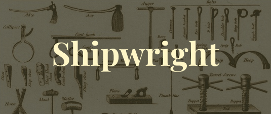

Shipwright
==========



```lua
-- shipwright_build.lua
local palette = require("zenbones").palette
run(palette,
  function(colors)
    return {
      fg = colors.red,
      ...
    }
  end,
  contrib.alacritty,
  {overwrite, "extra/alacritty.yml"})
```

- [Requirements & Install](#requirements--install)
- [What is Shipwright?](#what-is-shipwright)
- [What is a transform?](#what-is-a-transform)
- [Applying transforms](#applying-transforms)
- [Example: converting a colorscheme into an Alacritty theme](#example-converting-a-colorscheme-to-an-alacritty-theme)
- [`:Shipwright <build_file>`](#shipwright-build_file)
- [Transform list](#transform-list)
- [Transform helpers](#transform-helpers)

## Requirements & Install

Shipwright requires a lua runtime, it probably works in any version of neovim.

Install with any package manager:

```lua
use "rktjmp/shipwright.nvim"
```

## What is Shipwright?

Shipwright is a build system, originally designed for use with
[Lush.nvim](https://github.com/rktjmp/lush.nvim), but it can be applied
generally to any data, particularly colorscheme data.

It is packaged as a neovim plugin, but it can be called from any Lua runtime.

Shipwright runs a simple functional pipeline, where functions transform data in
order, feeding their result to the next function in the pipeline. These
transforms can include conversion to a vim colorscheme, terminal emulator
colorscheme, writing to different files, etc.

Shipwright comes with a number of [included transforms](#transform-list) and
you can easily write your own (they're just functions).

## What is a transform?

A Shipwright transform is a function *that accepts a table* and *returns a
table*, that is the only constaint. The tables can contain strings, functions,
other tables, etc.

Transforms can optionally take any number of additional arguments.

Shipwright also includes a number of [transform helpers](#transform-helpers) to
perform common tasks.

```lua
-- calculates the total length of all strings in a table,
-- optionally accepts an initial value.
local total_length = function(input_table, initial)
  sum = initial or 0
  for _, line in ipairs(input_table) do
    sum = sum + string.len(line)
  end

  -- we must return a table, in this case we will return the
  -- original table and the summed length
  return {input_table, sum}
end

return total_length
```

## Applying transforms

You can invoke a pipeline with `run()`. It accepts an initial value and then
any number of transforms.

```lua
run(
  -- start with a table
  {"ship", "of", "theseus"},
  -- pass to our transform,
  total_length,
  -- we can define inline transforms easily too
  function(val)
    -- remember total_length returned {input_table, length}
    print(string.format("%s is %d characters long (without spaces)",
                        table.join(val[1], " "), val[2]))
    -- we must return a table, lets drop the length
    return val[1]
  end)
  -- run itself is a transform, so you could also capture
  -- the value return if you wanted.
```

It's important to remember:

- The build file is "just lua", you can use any normal lua inside it, including
  loops, other modules, etc.
- Transforms are "just functions", so it's very simple to write your own
  extensions to the provided transforms.

## Example: converting a colorscheme to an alacritty theme

As an example, we will convert a colorscheme into a (truncated) Alacritty
colorscheme. It is assumed the colorscheme is available as a lua table, either
as a lush parsed spec, or a simple palette.

> Note: Shipwright provides an alacritty transform (`contrib.alacritty`), as
> well as a template transform, but it makes a good example.

To do this we will need to create a "build file" that:

- collects a subset of colors to export.
- converts `#000000` hex values to `0x000000`.
- downcases our hex values.
- generates a yaml file for use with Alacritty.

<details>

```lua
-- We will say this transform expects to get a table shaped as:
--
-- {
--   primary = {
--     bg = color
--     fg = color
--   }
-- }
--
-- along with a name.

local function hash_to_0x(color)
  return string.lower(string.gsub(color, "^#", "0x"))
end

-- this transform accepts a table and a name
local function alacritty(colors, name)
  return {
    "# Colors: " .. name,
    "colors:",
    "  primary:"
    "    background: '" .. hash_to_0x(colors.primary.bg) .. "'",
    "    foreground: '" .. hash_to_0x(colors.primary.fg) .. "'",
  }
end

return alacritty
```

```lua
-- shipwright_build.lua

local colorscheme = require("my_colorscheme")

run(colorscheme,
  -- we must process our colorscheme to conform to the alacritty transforms format.
  -- we can do this with an inline transform.
  function (groups)
    return {
      primary = {
        bg = groups.Normal.bg,
        fg = groups.Normal.fg
      }
    }
  end,

  -- now we can pass to alacritty, note that the transform accepts a name,
  -- so we use a table with the transform and it's argument.
  {alacritty, "my_colorscheme"},

  -- and now we can write, either to share or to our local config
  {overwrite, "~/.config/alacritty/colorscheme.yaml"}

  -- note, as overwrite is a transform, it *must* return a table, and infact
  -- overwrite returns the same lines it was given. we can pass these lines
  -- another transform.
  {overwrite, "extra/terms/alacritty.yaml"})
```

</details>

## `:Shipwright <build_file>`

Shipwright includes one command, `:Shipwright <build_file>` which will load
and execute the given build file, or if no buildfile is specified, Shipwright
will look for `shipwright_build.lua` in the current working directory.

Transform list
--------------

Every transform accepts and returns a table, this is implied in the
documentation, so "returns commands" means "returns a list of strings, where
each string is a command".

**`prepend`**

- Prepends given arguments to given table.
- Accepts
  - a table of items to prepend, or a single item

<details>

```lua
run(melange,
  to_vimscript,
  {append, "append this line"})
```

```lua
run(melange,
  to_vimscript,
  {append, {"append", "these", "lines"})
```

</details>

**`append`**

- Appends given arguments to given table.
- Accepts
  - a table of items to append, or a single item

<details>

```lua
run(melange,
  to_vimscript,
  {prepend, "prepend this line"})
```

```lua
run(melange,
  to_vimscript,
  {prepend, {"prepend", "these", "lines"})
```

</details>

**`overwrite`**

- Writes the given table (assumes strings) to path, overwrites any existing
  content.
- Accepts
  - a path to write to

<details>

```lua
run(melange,
  to_vimscript,
  {overwrite, "colors/melange.vim"})
```

</details>

**`patchwrite`**

- Writes the given table (assumes strings) to path, writes content only between
  given start and stop markers.
- Accepts
  - a path to write to
  - a string to match against, indicating where writing should start
  - a string to match against, indicating where writing should stop

<details>

```viml
" colors/double.vim
let ...
let ...
" PATCH_OPEN
" This content will be replaced
" PACH_CLOSE
```

```lua
run(doubletrouble,
  to_vimscript,
  {patchwrite, "colors/double.vim", [[" PATCH_OPEN]], [[" PATCH_CLOSE]]})
```

```viml
" colors/double.vim
let ...
let ...
" PATCH_OPEN
highlight ...
" PACH_CLOSE
```

</details>

**`branch`**

- Takes a given value and a pipeline, passes the value through the pipeline but
  *returns the original value*.
- Accepts
  - any number of transforms

<details>

```lua
run(zenbones,
  to_vimscript,
  {branch,
    vim_compatible_vimscript,
    {prepend, [["vim-compatible, see http://... for more details]]},
    {patchwrite, "../dist/...", [[" M_OPEN]], [[" M_CLOSE]]}},
    -- though vim_compatible_vimscript has altered the highlight rules, the original
    -- unmodified rules are passed to the rest of the pipeline.
  {branch,
    {patchwrite, "colors/", [[" M_OPEN]], [[" M_CLOSE]]}})

-- or
run(zenbones,
  extract_term_colors, -- generic map of colors to use in terminals
  {branch,
    term_colors_to_kitty_map, -- translate generic map to kitty shaped map
    contrib.kitty,
    {overwrite, "extra/kitty.conf"}},
  {branch,
    term_colors_to_alacritty_map, -- translate generic map to alacritty shaped map
    contrib.alacritty,
    {overwrite, "extra/alacritty.yaml"}})
```

</details>

**`contrib.alacritty`**

- Converts given table to an alacritty colorscheme
- Accepts
  - a specifically shaped map, see transform for exact format.

**`contrib.kitty`**

- Converts given table to an kitty colorscheme
- Accepts
  - a specifically shaped map, see transform for exact format.

**`contrib.wezterm`**

- Converts given table to an wezterm colorscheme
- Accepts
  - a specifically shaped map, see transform for exact format.

Transform helpers
-----------------

A number of helpers are provided to cover common transform tasks. These are a
available under `shipwright.transform.helpers`, see the module for an up to
date list.

```lua
return {
  -- split string into table by new lines
  split_newlines = split_newlines,
  -- apply "this is my $temp_late_1", {temp_late_1 = "replacement"} templating
  apply_template = apply_template,
  -- {r = 255, g = 255, b = 255} -> "0xffffff"
  rgb_to_hex = rgb_convert.rgb_to_hex,
  -- "0xffffff" -> {r = 255, g = 255, b = 255}
  hex_to_rgb = rgb_convert.hex_to_rgb
}
```

